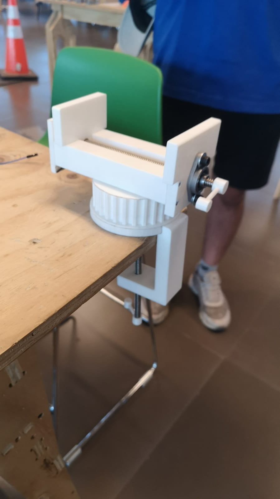
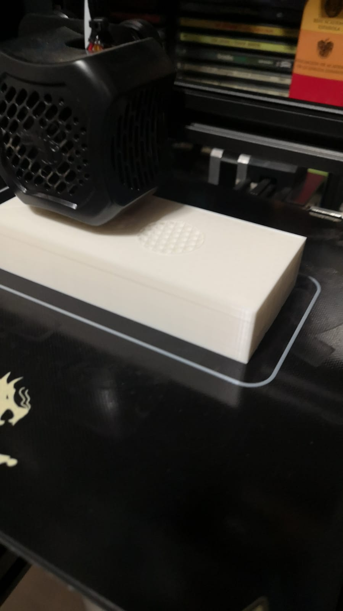
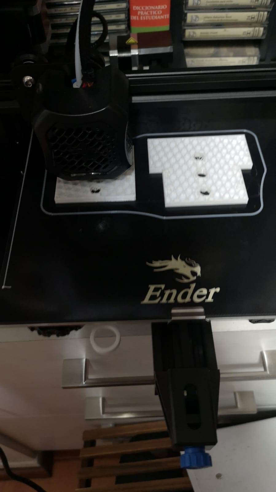

# Desk bench vise

This repo details the design and fabrication process for a desk sized bench vise, in context of a 3D Printing assignment for the ME4110 Procesos de Manufactura course, from the University of Chile’s Civil Mechanical Engineer career.

This project was developed by Pablo Betanzo, Juan Cantillana and Gustavo Rivera.

Read in [Spanish](LEEME.md).

The assignment had the following requirements: Minimum opening distance of 100 [mm] (around 1 snickers bar long); mostly 3D printed parts, save for bolts, bearings, etc. which could be sourced commercially.

### Description and purpose of the design

 A bench vise has a pretty simple purpose: keeping objects in place, in order for the user to have an easier time working with this object. It’s often used for cutting, sanding, and similar processes that require force and stability. 

 This design consists of a fixed jaw, and a mobile jaw that moves by the action of a lead screw, and is guided by a rail in the base. The lead screw is axially fixed, so only the mobile jaw moves using a nut. The purpose of the rail, apart from acting as a guide, is giving the object being held a platform where it can rest, or act as a parallel surface. 
The decision to keep the lead screw axially fixed, instead of a fixed nut, was made with user comfort in mind. Flanged mounted bearings with set screws were bought in order to achieve the lead screw’s axial restriction.

#### &nbsp;&nbsp;&nbsp;&nbsp; Assembly description

Apart from the basic functionality, a base that fixes the vise to the bench was designed. It works like a press, made with a screw, to avoid permanent fixation of the vise, which damages the surface’s integrity.

 Another added functionality is a variable vise angle. This was achieved using a printed pulley which was discarded from another course, and was given a new life. The angle is fixed by lifting the base, which has a key, and turning the pulley into one of the 5 fixed positions, determined by different keyways in the base.

### Component list

#### 1) Pulley:
This used 30% infill, 0.16 mm quality, and wasn't printed with supports or base.

Printing time: 06:44:00

Piece weight: 58g

#### 2) Pulley base:
This used 30% infill, 0.2 mm quality, and wasn't printed with supports or base.

Printing time: 04:54:00.

Piece weight: 44g.

#### 3) Vise base:
This used 30% infill, 0.2 mm quality, printed with supports, but no base.

Printing time: 11:04:00.

Piece weight: 98g.

#### 4) "C" shaped table support:
This used 30% infill, 0.2 mm quality, and wasn't printed with supports or base.

Printing time: 04:30:00.

Piece weight: 42g.

#### 5) Fixed jaw:
This used 20% infill, 0.2 mm quality, and wasn't printed with supports or base.

Printing time: 02:28:00.

Piece weight: 22g.

#### 6) Vise base end:
This used 20% infill, 0.2 mm quality, and wasn't printed with supports or base.

Printing time: 01:22:00.

Piece weight: 11g.

#### 7) Mobile jaw
This used 30% infill, 0.2 mm quality, and wasn't printed with supports or base.

Printing time: 01:54:00.

Piece weight: 18g.

#### 8) Handles:
This used 20% infill, 0.2 mm quality, printed with supports, but no base.

Printing time: 00:17:00.

Piece weight: 2g.

#### 9) Support screw end:
This used 20% infill, 0.2 mm quality, and wasn't printed with supports or base.

Printing time: 00:37:00.

Piece weight: 4g.

#### 10) Lead Screw:
Diameter: 8 mm.

Pitch: ACME T8.

Length: 300 mm.

Used for both of the assembly's screws.

#### 11) 8mm ID Flanged mounted bearing (2)

#### 12) M5 Bolts (4)

#### 13) M5 Nuts (4)

#### 14) M3 Bolts (8)

### Printing process
The printing was done in a Creality Ender 3 V2 3D printer, owned by a team member. Pictures of the process are presented next:

