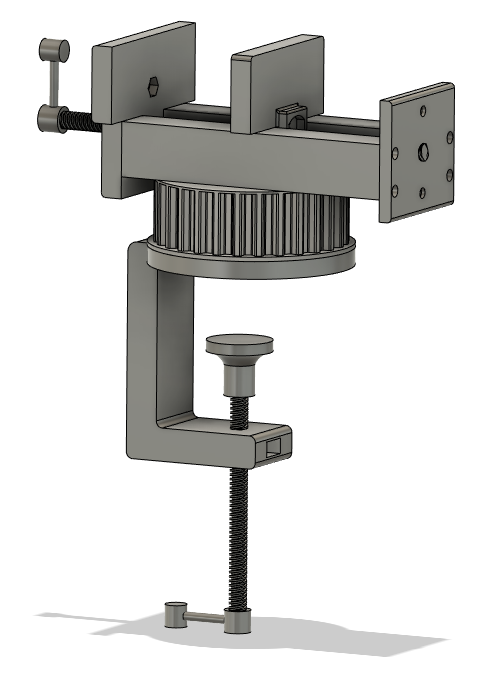
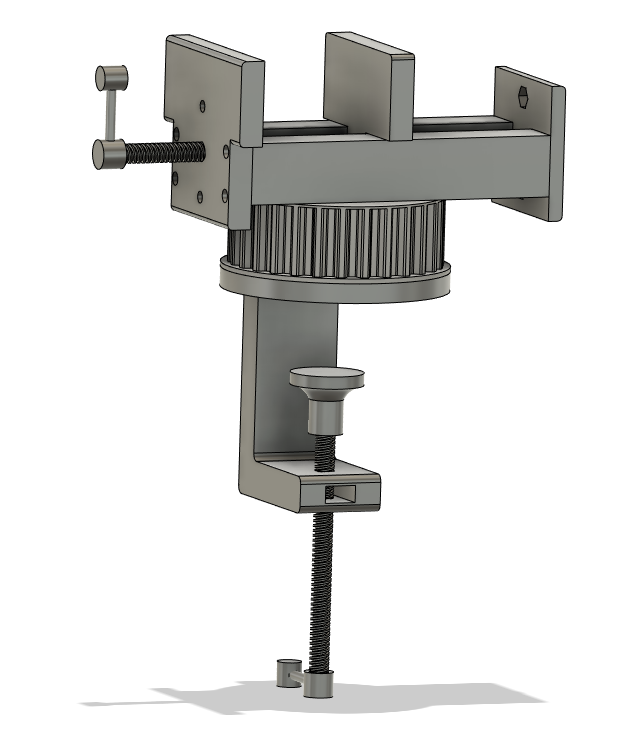

# Prensa de Banco de Escritorio

En este repositorio se detalla el diseño y fabricación de una Prensa de banco de escritorio para la tarea de impresión 3D del curso Procesos de Manufactura ME4110, de la carrera de Ingeniería Civil Mecánica, Universidad de Chile.

Este proyecto fue desarrollado por Pablo Betanzo, Juan Cantillana y Gustavo Rivera.

Los requerimientos solicitados fueron una abertura mínima de 100 [mm], y que las piezas fueran impresas en 3D, a menos que se requiriera alguna pieza comercial para elementos como pernos, rodamientos, etc.

### Descripción y finalidad del diseño

 Una prensa de banco tiene una finalidad bastante simple: mantener objetos en un lugar fijo, de manera de tener más libertad al momento de realizar ciertos procesos en estos objetos, como limar, cortar, etc. que requieran fuerza y estabilidad. 

 El diseño desarrollado consiste en una mordaza fija, y una mordaza móvil que se mueve por acción de un tornillo y guiada por un riel. El tornillo está fijo axialmente, y mediante una tuerca es sólo la mordaza móvil la que se traslada. La finalidad del riel, aparte de servir de guía, es dar una plataforma donde el objeto a presionar se puede sostener, o actuar de guía. También se decidió por un tornillo fijo, en vez de uno que se mueva axialmente como en otras prensas, por comodidad del usuario. Para sostener axialmente el tornillo se compraron rodamientos montados que tienen prisioneros para este fin. 

#### &nbsp;&nbsp;&nbsp;&nbsp; Descripción del ensamble

Además de la funcionalidad básica, se diseñó una base que se acopla a la mesa de trabajo con un tornillo, de manera de no perjudicar la integridad de esta con perforaciones. 

Otra funcionalidad añadida fue la posibilidad de cambiar el ángulo de la prensa. Esto se logró con una polea impresa que fue descartada de otro curso, y se aprovechó para este fin. La fijación se logra quitando la base de la prensa, y girando a una de las 5 posiciones predeterminadas.

### Listado de componentes

#### 1)Polea:
Presenta un 30% de infill; 0.16 mm de calidad; y no ocupa ni soportes ni una base.

Tiempo de impresión: 06:44:00.

Peso de pieza: 58g.

#### 2) Base polea:
Presenta un 30% de infill; 0.2mm de calidad; y no ocupa ni soportes ni una base.

Tiempo de impresión: 04:54:00.

Peso de pieza: 44g.

#### 3) Base Prensa:
Presenta un 30% de infill; 0.2mm de calidad; no ocupa una base pero si soportes.

Tiempo de impresión: 11:04:00.

Peso de pieza: 98g.

#### 4) Soporte mesa C:
Presenta un 30% de infill; 0.2mm de calidad; y no ocupa ni soportes ni una base.

Tiempo de impresión: 04:30:00.

Peso de pieza: 42g.

#### 5) Mordaza fija:
Presenta un de 20% infill; 0.2mm de calidad; y no ocupa ni soportes ni una base.

Tiempo de impresión: 02:28:00.

Peso de pieza: 22g.

#### 6) Tapa base:
Presenta un 20% de infill; 0.2mm de calidad; y no ocupa ni soportes ni una base.

Tiempo de impresión: 01:22:00.

Peso de pieza: 11g.

#### 7) Mordaza móvil
Presenta un 30% de infill; 0.2 mm de calidad; y no ocupa ni soportes ni una base.

Tiempo de impresión: 01:54:00.

Peso de pieza: 18g.

#### 8) Manivelas:
Presenta un 20% de infill; 0.2 mm calidad; no ocupa una base pero si soportes.

Tiempo de impresión: 00:17:00.

Peso de pieza: 2g.

#### 9) Tope:
Presenta un 20% de infill; 0.2 mm calidad; y no ocupa ni soportes ni una base.

Tiempo de impresión: 00:37:00.

Peso de pieza: 4g.

#### 10) Tornillo:
Diámetro: 8 mm.

Paso: ACME T8.

Largo: 300 mm.

Utilizado para los dos tornillos del ensamble.

### 11) Bloques de Rodamientos (2)

### 12) Pernos M5 (4)

### 13) Tuercas M5 (4)

### 14) Pernos M3 (8)
